# loyainiti-FE

Frontend monorepo for [`loyainiti-BE`](https://github.com/Amirali-Khamseh/loyainiti-BE). Two independent applications share a single design system:

- **`web/`** — Vite + React + TypeScript. Browser app for both customers and business owners.
- **`mobile/`** — Expo (React Native) + TypeScript. iOS/Android app with native QR scanner.
- **`design-system/`** — Canonical CSS tokens, TS tokens, SVG assets, and HTML component previews. Both apps duplicate from here.

## Setup

```bash
# Web
cd web
npm install
cp .env.example .env       # point VITE_API_URL at the BE
npm run dev                # http://localhost:5173

# Mobile (Expo)
cd mobile
npm install
cp .env.example .env       # EXPO_PUBLIC_API_URL
npx expo start             # scan QR with Expo Go
```

The backend defaults to `http://localhost:3000`. Start it from the `loyainiti-BE` repo:

```bash
docker compose up -d postgres
npm run db:migrate
npm run dev
```

## Stack

| Concern | Web | Mobile |
| --- | --- | --- |
| Framework | Vite 5 + React 18 + TS strict | Expo SDK 52 + Expo Router 4 + TS strict |
| Routing | React Router 6 | Expo Router (file-based) |
| Data | TanStack Query 5 | TanStack Query 5 |
| Auth | `better-auth/react` (session cookies) | `better-auth/react` + `@better-auth/expo` |
| Styling | CSS Modules + `tokens.css` | RN `StyleSheet` + `tokens.ts` |
| Forms | `react-hook-form` + `zod` | same |
| Icons | `lucide-react` | `lucide-react-native` |
| Charts | `recharts` | `victory-native` |
| QR scan | manual entry (camera follow-up) | `expo-camera` |

## Web app walkthrough

Screenshots below are from the **web** app running against the backend with seeded
demo data. Role-based routing decides what each account sees: a customer sees the
customer pages; a `business_owner` / `staff` user sees the business console (plus the
customer pages for any shop they're a member of).

> The internal SaaS admin console (`/_console/*`) is intentionally not shown here — it
> is hidden from the public app and used only for platform operations.

### Authentication

Email + password auth backed by session cookies (`better-auth`). The sign-in screen
routes new users to a **Customer** or **Business** sign-up flow, and every form carries
a hidden honeypot field to trap bots. Sign-up collects country + city so the explorer
can surface local shops first; passwords require 8+ characters with a letter and a number.

| Sign in | Create account |
| --- | --- |
| 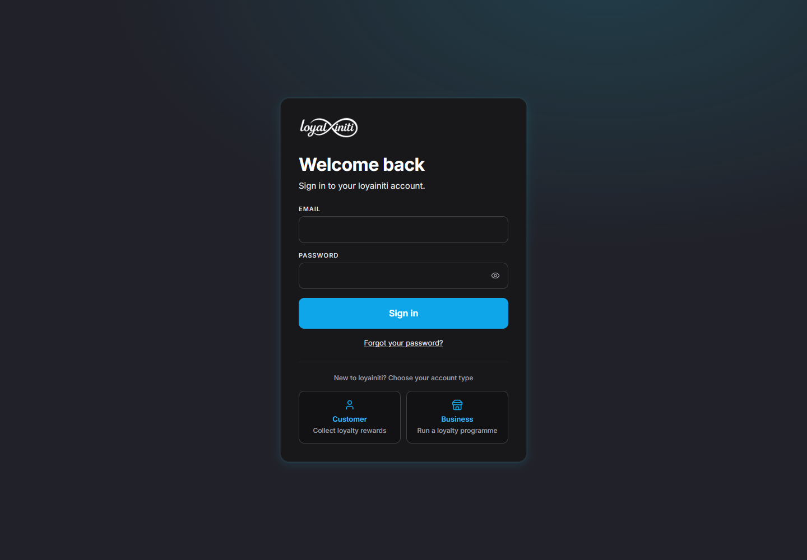 | 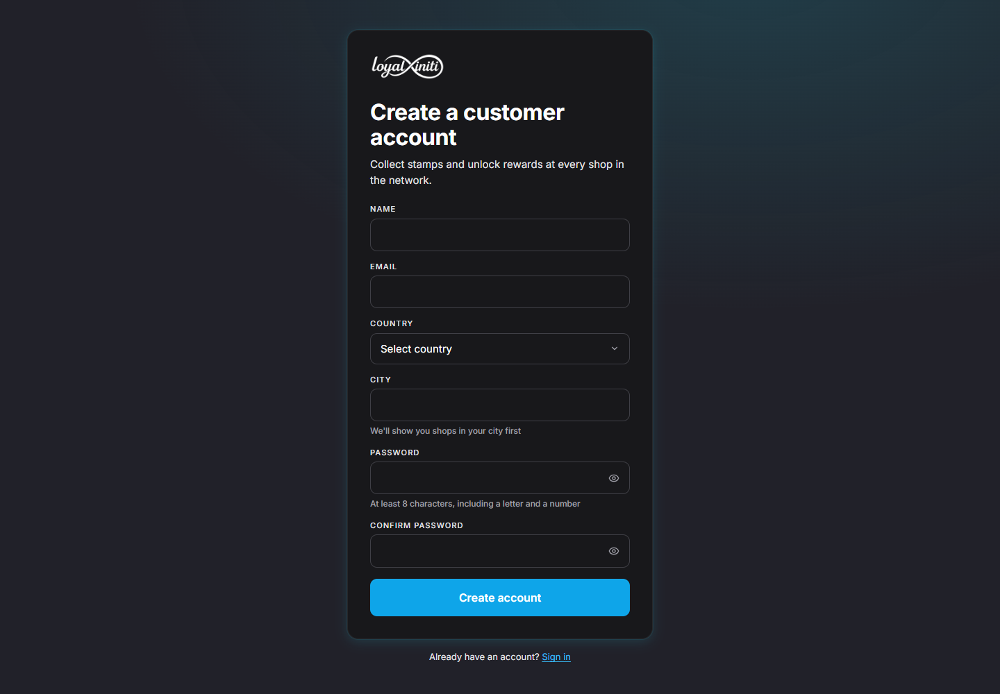 |

### Customer experience

**Explore** — the public landing page. A hero, a *Browse by category* grid (10 main
categories, each showing how many shop types it holds), and *All shops on the network*
with a country filter, text search, and an interactive map. Logged-in customers can
favourite any shop straight from the grid.

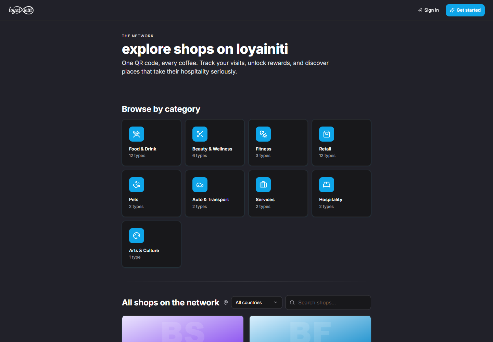

**Category** — drilling into a category (e.g. *Food & Drink*) shows a chip row of
sub-types (Cafe, Coffee Shop, Restaurant…) that filters the shop cards. Each card shows
the shop's logo, categories, description, and rating.

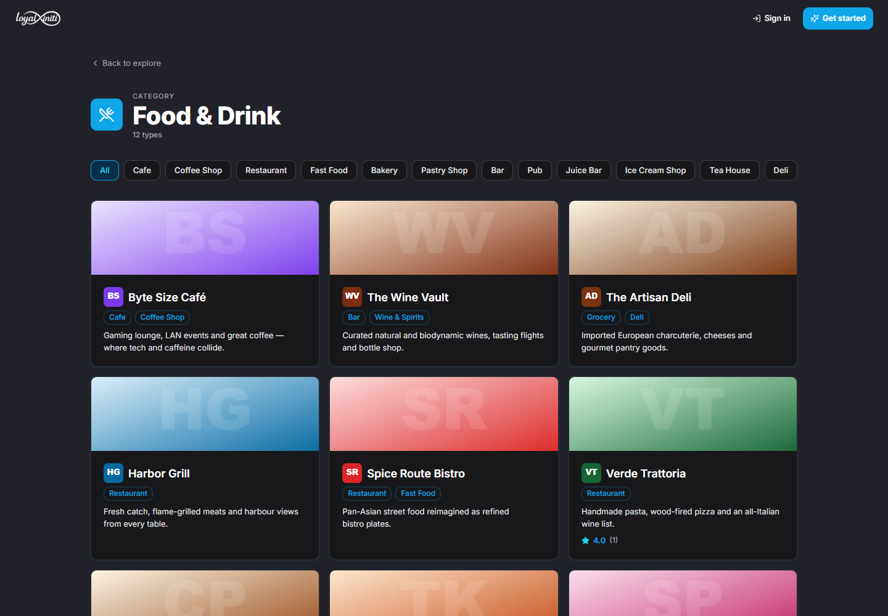

**Shop view** — a public shop page: cover image, logo, categories, description, address,
weekly opening hours, and a live location map. Customers can favourite the shop and see
its menu and reward path.

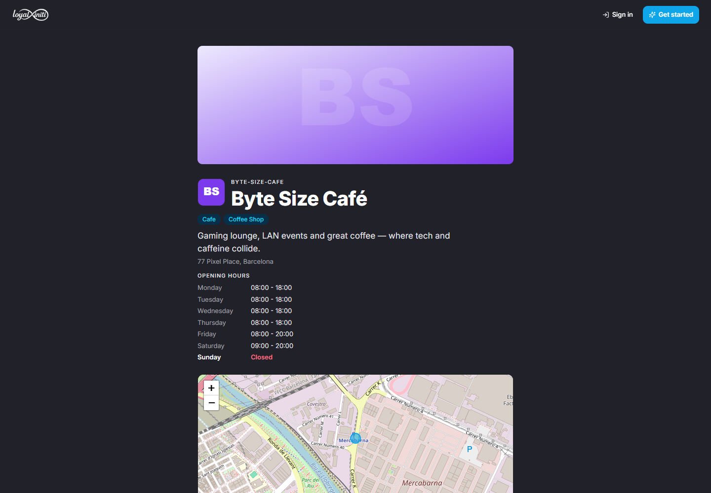

**My QR** — the customer's loyalty card. Any shop in the network scans this QR (or types
the 12-character fallback code) to record a visit and advance rewards. Also shows the
account name, email, and `user_id`.

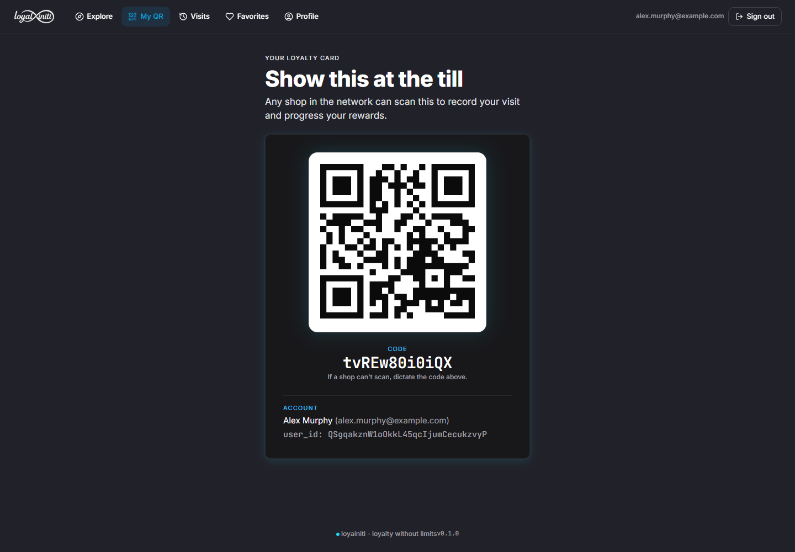

**Visits & rewards** — a history of every visit plus *Rewards in progress*: a stamp card
per shop showing collected vs. required stamps and the reward you're working toward.

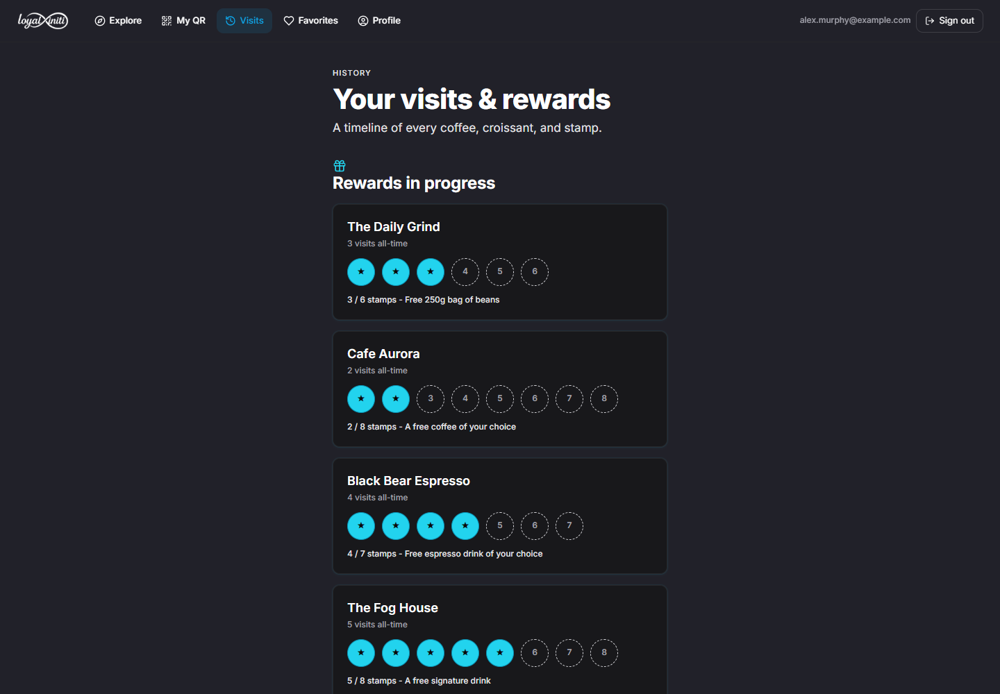

**Favorites** — every shop you've saved, as cards with a filled heart. Tap the heart to
remove.

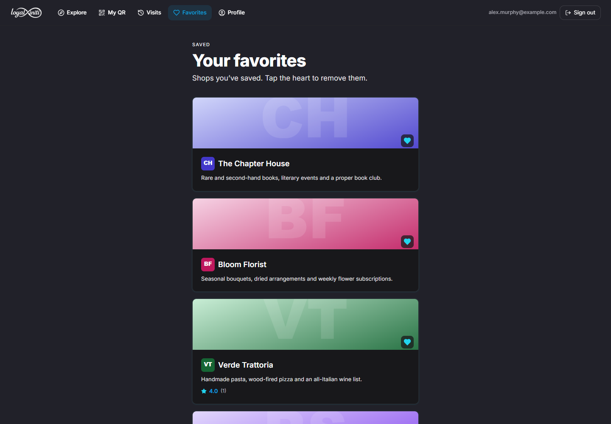

**Profile** — edit your public regular profile: avatar, display name, short bio (shops
see this when they look you up), and country/city. Also surfaces account details.

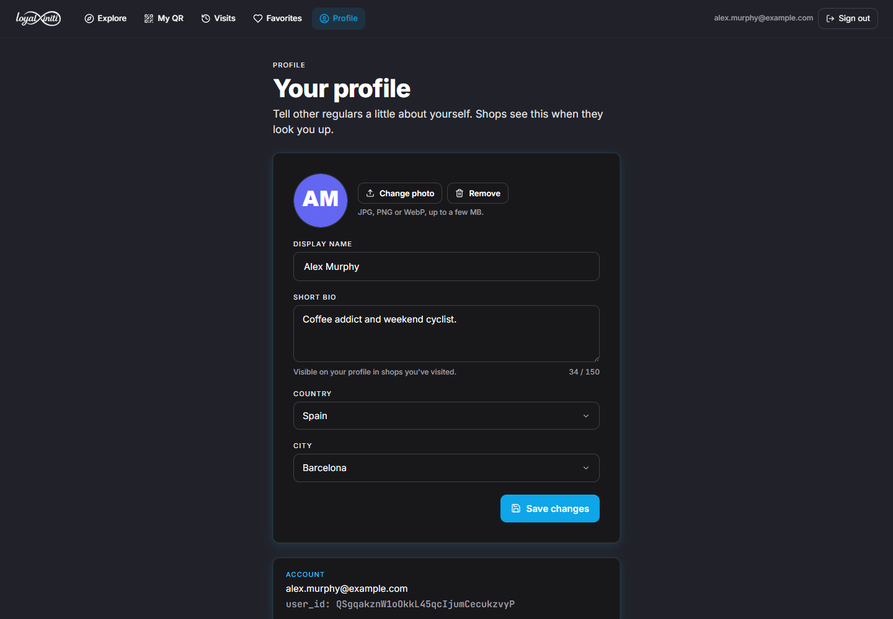

### Business experience

**Stats dashboard** — headline KPIs (visits, unique customers, new members, redemptions,
average visits per customer) over a selectable date range, a *Visits over time* chart, and
a *Top customers* leaderboard. Weekly / monthly activity can be exported to Excel.

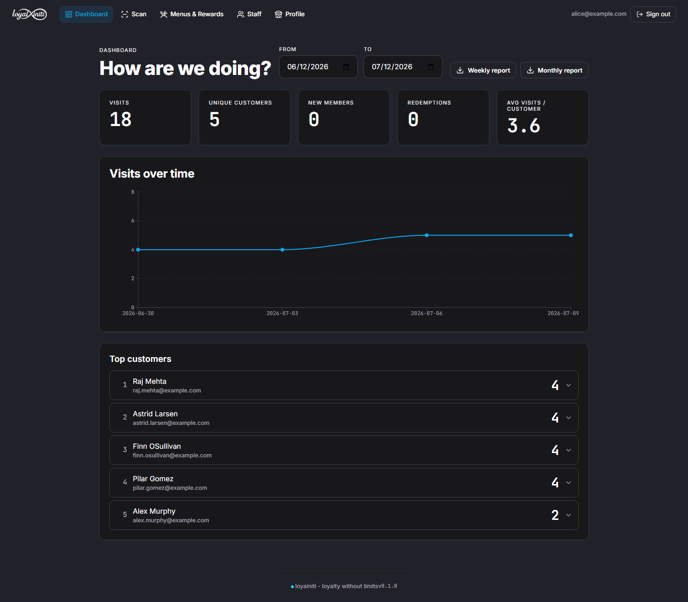

**Scan** — record a visit by typing or pasting the customer's QR code id (the mobile app
uses the camera). The panel then shows that customer's reward progress.

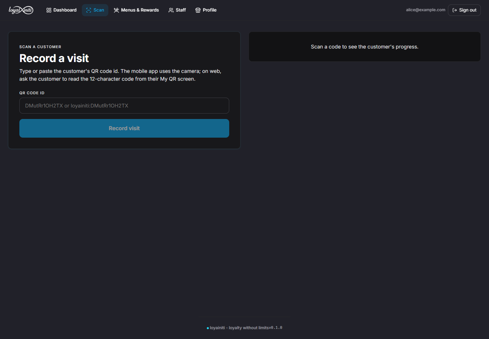

**Menus & Rewards** — curate what customers see: a **public menu** (categories + items
with prices and images), an optional **member menu** for loyalty members, and the
**loyalty programme** itself (name, visits required, reward, optional deadline).

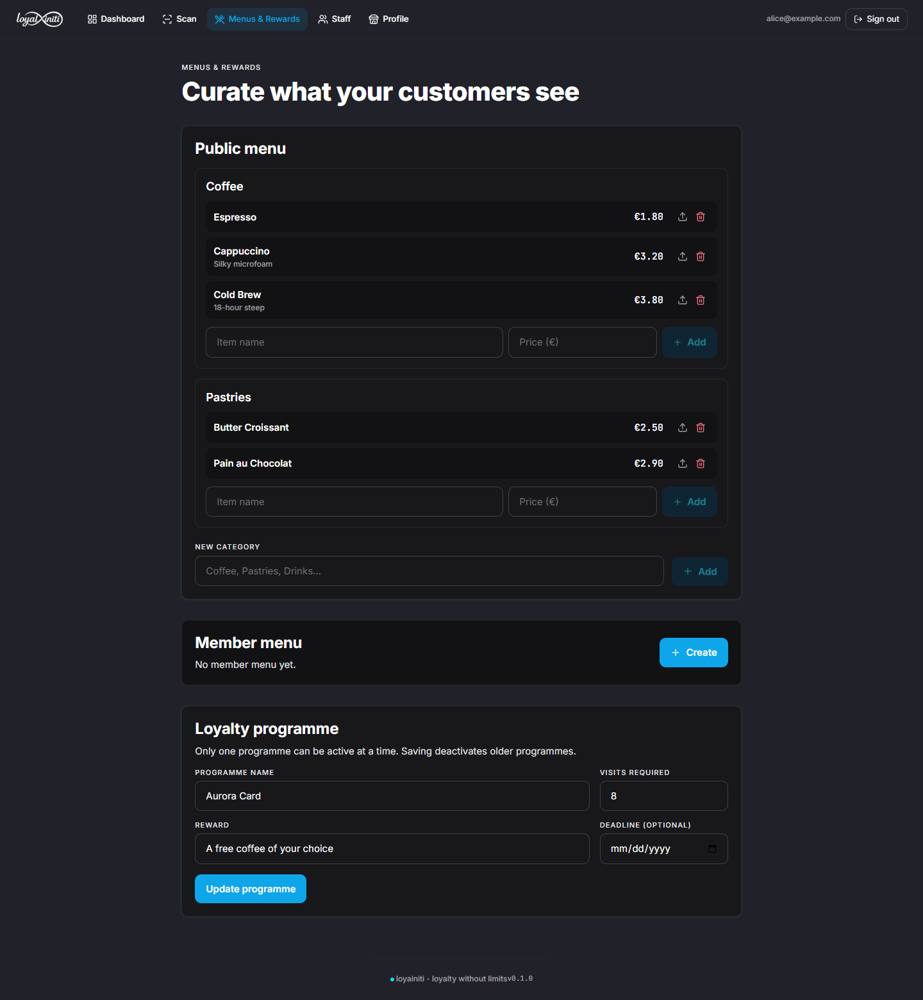

**Business profile** — manage the shop's public identity: name, description, address,
logo + cover image, category selection, per-day opening hours, photo gallery, and a
publish toggle that controls visibility in the explorer.

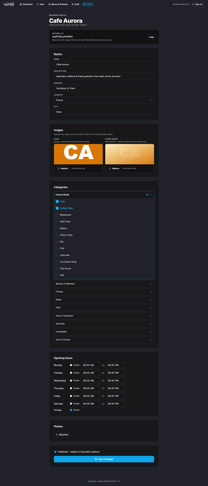

---

See [`design-system/README.md`](./design-system/README.md) for visual identity, fonts, and component previews.
